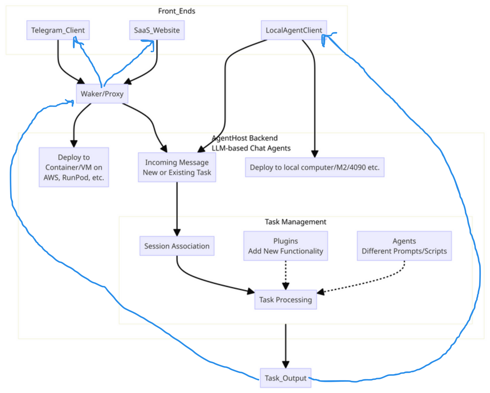

# Overview/Plan

The goal is to create a fully open source agent hosting platform. This will support custom (open source or proprietary) 
front-ends, as well as plugins and agents (again, some open source, some proprietary).

# AgentHost Backend

This is the core program running LLM-based chat agents capable of executing functions, running scripts, and accessing data.

**Rust**: Building the core with Rust because:

- very efficient

- Rhai scripting integrated

- memory safe

- can integrate ML libraries in Rust like candle or 
  C++ libraries like llama.cpp, stablediffusion.cpp, bark.cpp (text-to-speech) etc.
  (until Rust libraries are ready)

- going with the flow: trend is for many languages to try to be more like Rust 
  (e.g. increasing use of types in Python, use of TS and disdain for JS)

**HTTP API**

**llama.cpp Integration**: This allows the AgentHost to run Mixtral/llava quantized on local computers if they have good acceleration 
(such as new Macs, 4090, etc.).

## Plugins and Agents / Registries

Plugins add new functionalities to the system, while Agents, with different prompts and script configurations, leverage these Plugins.

AgentHost back end has HTTP endpoints for installing plugins, installing agents, removing. 

Installation involves:

- download and uncompress files

- optionally run Rhai install script

### Plugin Registry
 
 Allows anyone to upload/download/rate plugins.

### Agent Registry

Allows anyone to upload/download/rate agents.
 

## Task Management

### Associating Messages with Tasks

Each message will need to be associated with a session for an existing or new Task. The system needs to handle this, with automatic determination by the LLM in cases where the user cannot specify the task/session easily. For example, a WhatsApp client won't necessarily have a convenient way for a user to select a different session/task, such as is typical with web-based chat interfaces.

### Determining Task Completion

The system needs a mechanism to handle long-running tasks. This might involve some kind of supervisor agent or prompt that determines
whether the task has really been completed. Or it might be sufficient to continue the session as long as more functions are being called,
or until the agent indicates it has finished.

# Front Ends

Various types of front ends interface with the AgentHost:

- LocalAgent: Runs locally on users' computers.

- TelegramAgent: Interfaces with Telegram, forwarding messages to the AgentHost and responses back to Telegram users.

- SaaS Website: A custom front end for business applications.

Other potential front ends using the HTTP API.

# Waker/Proxy

This is responsible for: 

- deploying AgentHost to infrastructure providers. It manages starting and stopping of the AgentHost on demand. For instance, it starts the AgentHost server/container instance when needed by TelegramAgent.

- passing messages to and from the deployed AgentHost

# Installation

Clone repo and run `cargo build`.
Place scripts in `scripts` dir.

Run with `./target/release/agenthost`
